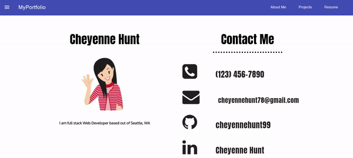

# reactProfile

## Table of contents

- [General info](#general-info)
- [Technologies](#Technologies)
- [Summary](#Summary)
- [Usage](#Usage)
- [Expectations](#Expectations)
- [Author](#Author)
- [License](#License)

## General info

React portfolio deployed on Heroku 

## Technologies
- [React](https://reactjs.org/)
- [HTML]
- [CSS]
- [JavaScript](https://www.javascript.com/)
- [Heroku](https://id.heroku.com/login)
- [package.json](https://docs.npmjs.com/creating-a-package-json-file)
- [npm](https://www.npmjs.com/)
## Summary
My portfolio displaying my best work using react 

## Usage
- `$ npm install`
- `$ npm install --save-dev nodemon`
- `$ npm start`
- `Ctrl+C` stop running locally 

## Expectations

Link to Heroku App : https://peaceful-falls-43778.herokuapp.com/projects

## Author

Cheyenne Hunt

## License

Open Source